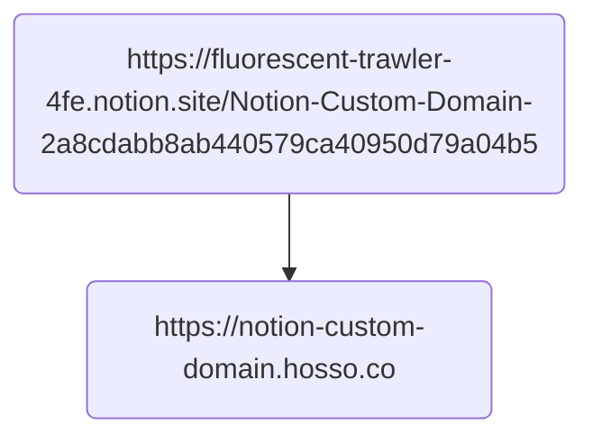

# Notion Custom Domain

A rework of [hosso/notion-custom-domain](https://github.com/hosso/notion-custom-domain).


## What's different?

This repo is a **self-hosted** version while the origin is a serverless version
aiming at serving on Vercel.

## How to use it?

1. Clone the repo
2. Build the image
3. Run with proper parameters

Here is an example *docker-compose.yaml* file:

```yaml
version: "3.9"

services:
  notion:
    build: ./
    image: notion
    restart: always
    ports:
        - 3000:3000
    environment:
        START_PAGE_URL: https://fluorescent-trawler-4fe.notion.site/Notion-Custom-Domain-2a8cdabb8ab440579ca40950d79a04b5
        GA_TRACKING_ID:
```

## Real example



[](https://notion-custom-domain.hosso.co)
